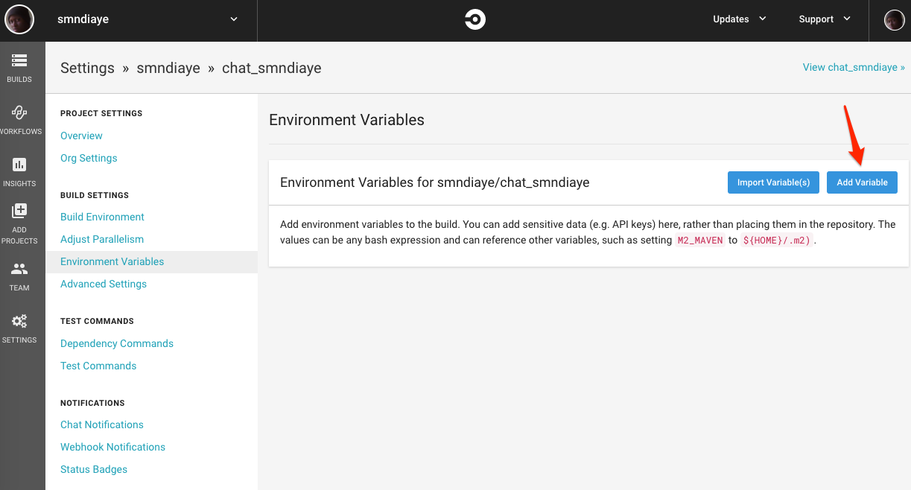
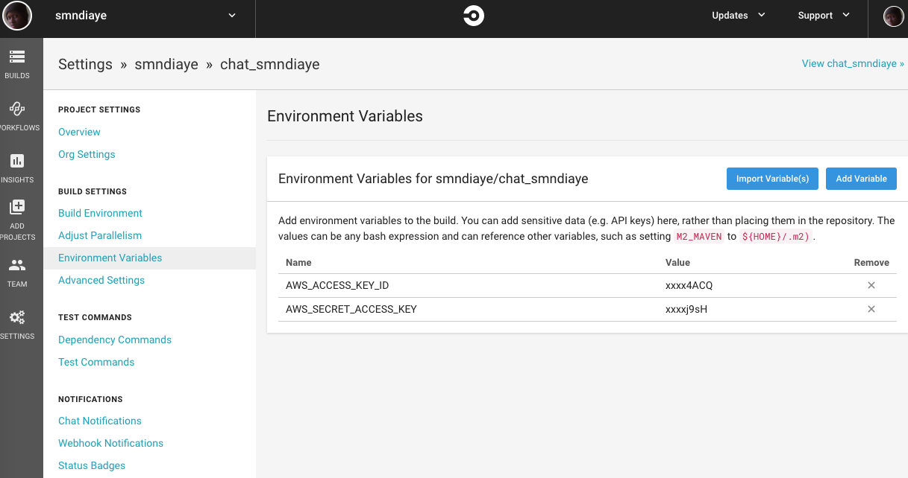
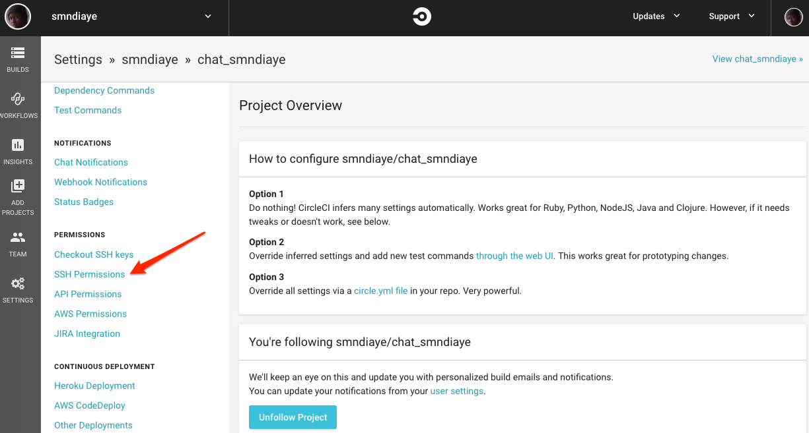
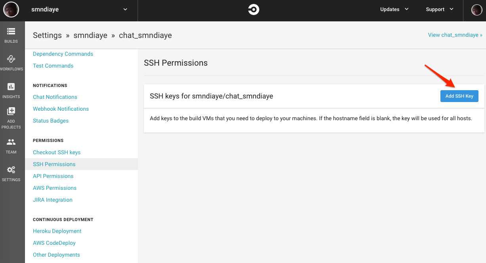
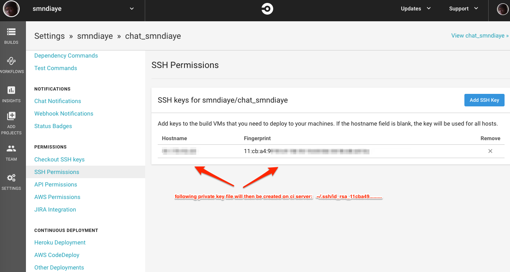

### Table of Contents
  - [Webpacker and ReactJS Setup](#rails-5,-webpacker-and-reactjs-setup)
  - [Unicorn and Capistrano setup](#unicorn-and-capistrano-setup)
  - [CircleCi Setup](#circleci-setup)
  - [Deploy From CircleCi](#deploy-from-circleci)
  
### Rails 5, Webpacker and ReactJS Setup
- references
  - [webpacker github](https://github.com/rails/webpacker)
- Environment
  - Ruby 2.4.2
  - Rails 5.1.5
  - Webpacker 3.2.2

- install webpacker
  - rails \_5.1.5_ new app_name -d mysql --webpack=react
  
### Unicorn and Capistrano Setup
- references
  - [unicorn github](https://github.com/defunkt/unicorn)
  - [capistrano github](https://github.com/capistrano/capistrano)

- add gems

    ```
    # Unicorn
    gem 'unicorn'
    
    group :development, :test do
      # Capistrano
      gem 'capistrano'
      gem 'capistrano-bundler'
      gem 'capistrano-rails'
      gem 'capistrano-rbenv'
      gem 'capistrano3-unicorn'
    end

    ```
- capistrano setup

    - installation
    
        ```
            bundle install
            bundle exec cap install
           
           ├── Capfile
           ├── config
           │   ├── deploy
           │   │   ├── production.rb
           │   │   └── staging.rb
           │   └── deploy.rb
           └── lib
               └── capistrano
                   └── tasks
                   
        ```
    - Capfile
        ```
        # Load DSL and set up stages
        require 'capistrano/setup'
        
        # Include default deployment tasks
        require 'capistrano/deploy'
        
        # Load the SCM plugin appropriate to your project:
        require 'capistrano/scm/git'
        install_plugin Capistrano::SCM::Git
        
        # Include tasks from other gems included in your Gemfile
        # require "capistrano/rvm"
        require 'capistrano/rbenv'
        set :rbenv_type, :user
        set :rbenv_custom_path, '/usr/local/rbenv'
        # require "capistrano/chruby"
        require 'capistrano/bundler'
        require 'capistrano3/unicorn'
        require 'capistrano/rails/assets'
        # require "capistrano/rails/migrations"
        # require "capistrano/passenger"
        
        # Load custom tasks from `lib/capistrano/tasks` if you have any defined
        Dir.glob('lib/capistrano/tasks/*.rake').each { |r| import r }

        ```
    - deploy.rb
    
        ```
        # config valid for current version and patch releases of Capistrano
        lock '~> 3.10.0'
        
        set :application, 'jotaay'
        set :repo_url, 'git@github.com:smndiaye/jotaay.git'
        
        # Default deploy_to directory is /var/www/my_app_name
        set :deploy_to, '/var/apps/jotaay'
        
        # Default value for linked_dirs is []
        append :linked_dirs, 'log', 'tmp/pids', 'tmp/cache', 'tmp/sockets'
        
        # Default value for keep_releases is 5
        set :keep_releases, 3
        
        
        namespace :deploy do
          desc 'Restart application'
          task :restart do
            invoke 'unicorn:restart'
          end
        end
        
        after 'deploy:publishing', 'deploy:restart'
        ```
    
    - deploy/staging.rb
    
        ```
        set :stage, :staging
        set :branch, 'staging'
        set :rails_env, 'staging'
        set :bundle_without, 'production'
        
        server 'ip.ip.ip.ip', user: 'ec2-user', roles: %w[web app]
        
        set :ssh_options, keys: %w[~/.ssh/some_key.pem],
            forward_agent: true,
            auth_methods: %w[publickey]
        ```
    
- unicorn setup

    - unicorn/staging.rb
    
        ```
        # -*- coding: utf-8 -*-
        # frozen_string_literal: true
        
        @app_path = '/var/apps/jotaay/current'
        
        worker_processes 6
        working_directory "#{@app_path}/"
        
        listen  "#{@app_path}/tmp/sockets/unicorn.sock"
        pid     "#{@app_path}/tmp/pids/unicorn.pid"
        
        stderr_path "#{@app_path}/log/unicorn.stderr.log"
        stdout_path "#{@app_path}/log/unicorn.stdout.log"
        
        preload_app true
        GC.respond_to?(:copy_on_write_friendly=) && (GC.copy_on_write_friendly = true)
        
        before_exec do |_server|
          ENV['BUNDLE_GEMFILE'] = @app_path + '/Gemfile'
        end
        
        before_fork do |server, worker|
          if defined?(ActiveRecord::Base)
            begin
              ActiveRecord::Base.connection.disconnect!
            rescue ActiveRecord::ConnectionNotEstablished
              nil
            end
          end
        
          old_pid = "#{server.config[:pid]}.oldbin"
          unless old_pid == server.pid
            begin
              sig = (worker.nr + 1) >= server.worker_processes ? :QUIT : :TTOU
              Process.kill sig, File.read(old_pid).to_i
            rescue Errno::ENOENT, Errno::ESRCH
            end
          end
        end
        
        after_fork do |_server, _worker|
          if defined?(ActiveRecord::Base)
            ActiveRecord::Base.establish_connection
          end
        end
        
        ```
 
   - deploy command
    
        `bundle exec cap staging deploy`

### CircleCi Setup

- rspec

    ```
    # Gemfile
    group :development, :test do
      gem 'rspec', '~> 3.5'
      gem 'rspec-rails', '~> 3.4', '>= 3.4.2'
      gem 'rspec_junit_formatter', '~> 0.3.0'
    end
    
    # Generate rspec files
    bundle install
    rails generate rspec:install
    ```
    
- create .circleci/config.yml

    ```
    version: 2
    jobs:
      build:
        docker:
           - image: circleci/ruby:2.4.2-node-browsers
             env:
               - RAILS_ENV=test
           - image: library/mysql:5.7
             command: mysqld --character-set-server=utf8mb4 --collation-server=utf8mb4_general_ci --innodb-large-prefix=true --innodb-file-format=Barracuda
             env:
               - MYSQL_ALLOW_EMPTY_PASSWORD=true
               - MYSQL_ROOT_HOST=%
    
        working_directory: ~/jotaay
    
        steps:
          - checkout
    
          # Download and cache dependencies
          - restore_cache:
              keys:
              - v1-dependencies-{{ checksum "Gemfile.lock" }}
              # fallback to using the latest cache if no exact match is found
              - v1-dependencies-
    
          # Restore yarn / webpacker cache
          - restore_cache:
              keys:
              - jotaay-yarn-{{ checksum "yarn.lock" }}
              - jotaay-yarn-
    
          # Install Dependencies
          - run:
              name: install dependencies
              command: |
                bundle install --jobs=4 --retry=3 --path vendor/bundle
    
          # Install yarn
          - run:
              name: yarn install
              command: yarn install
    
          # Save cache
          - save_cache:
              paths:
                - ./vendor/bundle
              key: v1-dependencies-{{ checksum "Gemfile.lock" }}
    
          # Store yarn / webpacker cache
          - save_cache:
              paths:
                - node_modules
              key: jotaay-yarn-{{ checksum "yarn.lock" }}
    
    
          # Webpacker compile
          - run:
              name: webpacker compile
              command: bundle exec bin/webpack
    
          # Database setup
          - run: bundle exec rake db:create
          - run: bundle exec rake db:schema:load
    
          # Rspec tests
          - run:
              name: rspec
              command: |
                 bundle exec rspec --profile 10 \
                                   --format RspecJunitFormatter \
                                   --out test_results/rspec.xml \
                                   --format progress \
                                   $(circleci tests glob "spec/**/*_spec.rb" | circleci tests split --split-by=timings)
    ```
    
### Deploy From CircleCi

Deploy rails code to aws ec2 when staging branch build runs

- .circleci/config.yml

    ```
    - run:
        name: install dependencies
        command: |
          sudo apt-get update && sudo apt-get install -y awscli
        
    # Staging Deploy
    - deploy:
        name:  Capistrano staging deploy
        command: |
          if [ "${CIRCLE_BRANCH}" == "staging" ]; then
            ./sh/staging_deploy.sh
          fi
    ```
    
- sh/staging_deploy.sh

   Dont forget to change file permission: `chmod a+x sh/staging_deploy.sh`
   ```
   #!/usr/bin/env bash
   
   set -ex
   
   export AWS_DEFAULT_REGION="ap-northeast-1"
   SECURITY_GROUP_ID="security group id"
   
   echo "Get Circle Ci IP"
   IP=`timeout 10 wget -q -O - ipcheck.ieserver.net`
   if [ "$?" -ne 0 ]
   then
     IP=`timeout 10 curl -s -f inet-ip.info`
   fi
   if [ "$?" -ne 0 ]
   then
     IP=`timeout 10 curl -s -f ifconfig.me`
   fi
   
   
   echo "Removing $IP from security group:$SECURITY_GROUP_ID on 0 1 2 3 15 signals"
   trap "aws ec2 revoke-security-group-ingress --group-id $SECURITY_GROUP_ID --protocol tcp --port 22022 --cidr $IP/32" 0 1 2 3 15
   
   echo "Opening up SSH on security group:$SECURITY_GROUP_ID for $IP"
   aws ec2 authorize-security-group-ingress --group-id $SECURITY_GROUP_ID --protocol tcp --port 22022 --cidr $IP/32
   
   echo "Running cap staging deploy"
   bundle exec cap staging deploy

   ```
   
- Circle Ci Environment Variables Setting: 
    - Create IAM user having EC2 access policy.
    - Add AWS_ACCESS_KEY_ID and AWS_SECRET_ACCESS_KEY as circle ci environment variables.

    
    
    
    
- Circle Ci SSH Permissions Setting

    
    
    
    
    
    
- config/deploy/staging.rb

Add following ssh options
```
set :ssh_options, keys: %w[~/.ssh/id_rsa_11cba49f92d1565316b56b3456d6e43a],
                  forward_agent: true,
                  auth_methods: %w[publickey]
```


